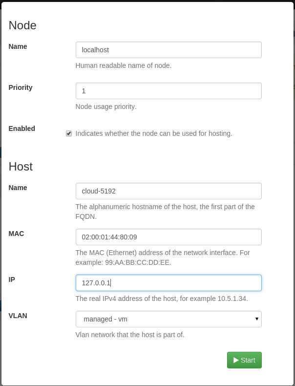
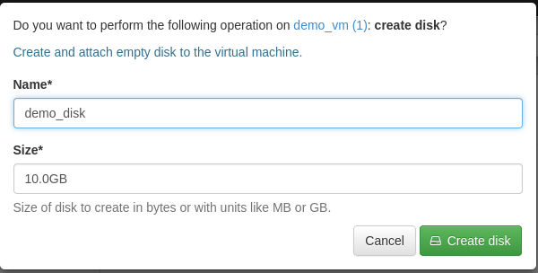
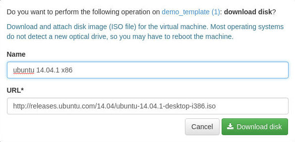
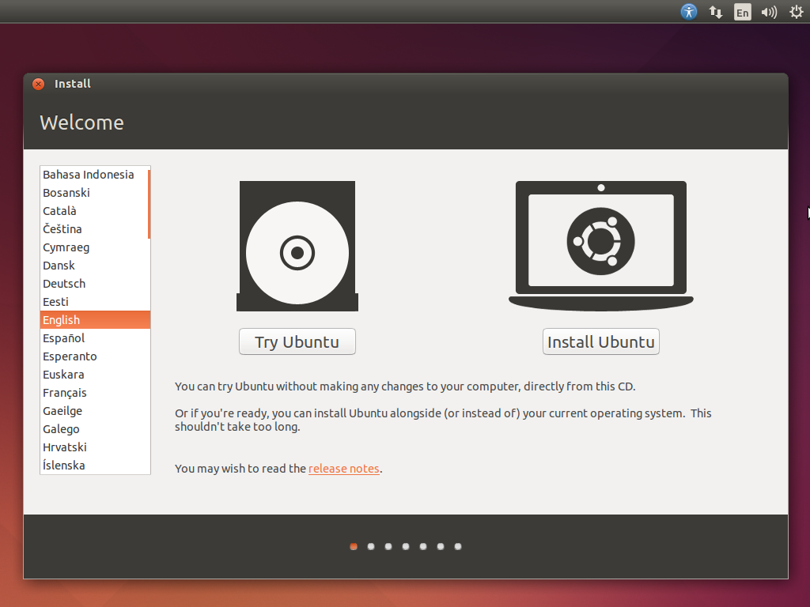

# Circle Project Salt Installer

## Install Salt

```bash
sudo add-apt-repository ppa:saltstack/salt
sudo apt-get update
sudo apt-get install salt-minion
```

## Configure salt
Open the salt minion configuration

```bash
sudo vim /etc/salt/minion
```

Add these lines:

```bash
file_client: local

file_roots:
  base:
    - /home/cloud/salt/salt

pillar_roots:
  base:
    - /home/cloud/salt/pillar
```
## Get the installer
Clone circle installer git repository into cloud home

```bash
git clone git@git.ik.bme.hu:circle/salt.git
```

## Remove node row from pillar/top.sls

## Change variables
Modify installer.sls file

```
sudo vim salt/pillar/installer.sls
```

Most used variables

* **admin_user**: user name to login in as admin on the site
* **admin_pass**: password to login in as admin on the site
* time zone: the server's time zone, format is region/city
* nfs
	* server: nfs server's hostname
	* network: nfs server's network to access files
	* directory: this directory will be shared
* storagedriver:
	* **queue_name**<sup>*</sup>: storage host name
* fwdriver
	* **queue_name**<sup>*</sup>: the server's hostname
	* **gateway**<sup>*</sup>: the server's gateway
	* **external_net**<sup>*</sup>: the server's network
	* **external_if**: the server's network interface

> <sup>**`*`**</sup> These variables need to be configured. Use `hostname`, `ifconfig`, `route -n` to get network information.

## Install Circle
Run the following installation command:

```bash
sudo salt-call state.sls allinone
```

After install, delete agent.conf file:

```bash
sudo rm /etc/init/agent.conf
```

### Current problems 

#### Gateway issue
```
cd circle/circle/
workon circle
./manage.py firewall_restart

# get eth0 MAC address
ifconfig
sudo -i
ip netns exec fw bash
ifconfig net hw ether <MAC>
```

#### Nginx issue
	Delete configuration file duplication and restart nginx
```
sudo rm /etc/nginx/sites-enabled/default
sudo service nginx restart
```

#### Open firewall
```
sudo ufw allow 443
sudo ufw allow 80
```

## Quickstart - Standalone Node

### Login
Log in into the Circle website with admin (the site is accessable on the 443 port). Name and password is in the `salt/pillar/installer.sls`.

### Create Node
To run virtual machines, we need to create nodes - and add to the system. Click on the new icon in the dashboard, Nodes menu.

#### Configure Node

To standalone configuration, type the current machine's hostname to Host/name, MAC address to Host/MAC, IP to HOST/IP. Choose managed-vm as VLAN.

#### Activate Node

Click on the 'Activate' icon to use the Node.

### Start Virtual Machine

To create new Virtual Machine, we use Templates - images based on previously saved VMs. Currently we haven't got any template - so let's create a new one. Click on Templates/new icon and choose 'Create a new base VM without disk'.

#### Configure Template

Set name, CPU and RAM settings, architecture. Check in the boot menu box, select network and lease, write down, which operating system will you use. Finally, create a template.
> The rows marked with astersk need to be filled.



#### Add disk

Currently we don't have any disks attached to our VM. To add, click on the Resources menu, 'create disk' icon, set the name and size.



#### Attach ISO

To install an OS, we can use ISO images, to boot from. Click on 'download disk' and type the ISO's URL.



### Start Virtual Machine
Finally, we can run the machine. Click on 'deploy' and start it. You can choose, on which node do you want to run.


