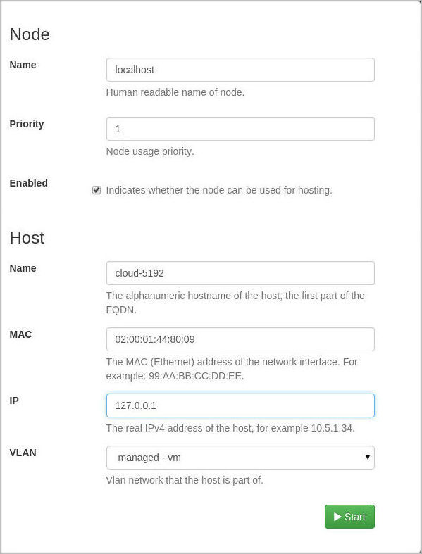
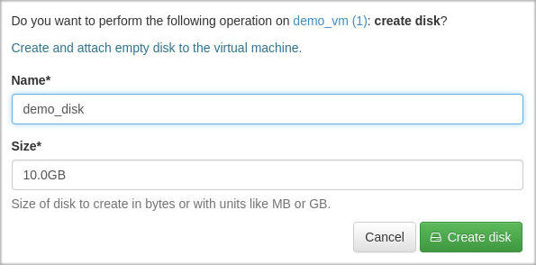
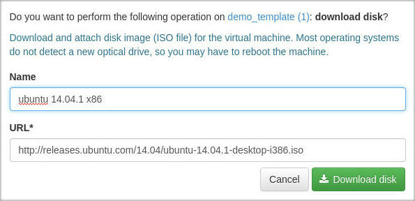
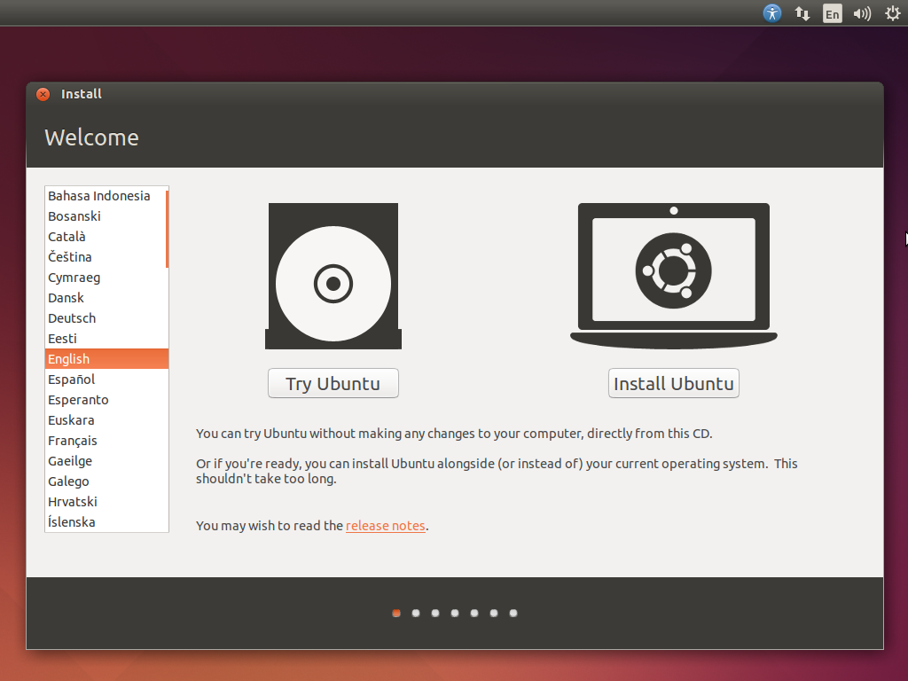

# CIRCLE Project - Salt Installer for multiple nodes

## OS Support

* Red Hat Linux family:
    * Red Hat Enterprise Linux 7+
    * Cent OS 7+
    * Scientific Linux 7+
* Debian Linux family:
    * Debian linux 8+
    * Ubuntu linux 14.04 LTS

## Prerequisites

### Red Hat family

Install EPEL repository (if the link is broken, please contact us):
```bash
sudo rpm -ivh http://dl.fedoraproject.org/pub/epel/7/x86_64/e/epel-release-7-5.noarch.rpm
```

Install some important packages:
```bash
sudo yum install python2-pip gcc vim git
```

### Debian family

Install some important packages:
```bash
sudo apt-get update
sudo apt-get install python-pip vim git
```

## Install Salt

```bash
sudo pip install salt==2014.7.1
```

## Get the installer
Clone circle installer git repository into cloud home

```bash
git clone https://git.ik.bme.hu/circle/salt.git
```

## Change variables
Modify installer.sls file
```
vim salt/pillar/installer.sls
```

Most used variables
-------------------
* **proxy_secret**: This is used to provide cryptographic signing, and should be set to a unique, unpredictable value.
* **secret_key**: This is used to provide cryptographic signing, and should be set to a unique, unpredictable value.
* **deployment_type**: local (development) or production
* **deployment_mode**: standalone or head or node
* **admin_user**: user name to login in as admin on the site
* **admin_pass**: password to login in as admin on the site
* **database**:
    * **password**: database user’s password
* **amqp**:
    * **password**: amqp user’s password
    * **host**: amqp server IP - usually runs at localhost
* **graphite**:
    * **password**: graphite user’s password
    * **host**: graphite server IP - usually runs at localhost
* **nfs**:
    * **enabled**: nfs is enabled
    * **server**: nfs server’s hostname
    * **network**: nfs server’s network to access files
    * **directory**: this directory will be shared
* **storagedriver**:
    * **queue_name**: the server’s hostname
* **fwdriver**:
    * **queue_name**: the server’s hostname
    * **gateway**: the server’s gateway
    * **external_net**: the server’s network
    * **external_if**: the server’s network interface

Other variables
---------------

* user: user who will install the software
* time zone: the server’s time zone, format is region/city
* amqp:
    * user: amqp user
    * port: amqp server’s port
    * vhost: virtual host - specifies the namespace for entities (exchanges and queues) referred to by the protocol
* agent:
    * repo_revision: revision
* agentdriver:
    * repo_revision: revision
* cache: cache url - usually pylibmc://127.0.0.1:11211/
* database:
    * name: django database’s name
    * user: database user
* fwdriver:
    * open_ports: True or False - open necessary ports for libvirt, nfs server and AMQP services (only for head machine)
    * repo_revision: revision
    * user: fwdriver user name
    * vm_if: vm interface
    * vm_et: vm network
    * management_if: management interface
    * reload_firewall_timeout: timeout for synchronous firewall reload
* graphite:
    * user: graphite user
    * port: graphite server’s port
    * secret_key: graphite’s secret key
* manager:
    * repo_revision: revision
* monitor-client:
    * repo_revision: revision
* storage-driver:
    * repo_revision: revision
* vm-driver:
    * repo_revision: revision
* vnc-driver:
    * repo_revision: revision
* vnc_port_range: FromPort, ToPort

## Install Circle
Run the following installation command:

*For head machine:*
```bash
sudo salt-call state.sls head --local --file-root=/home/$USER/salt/salt --pillar-root=/home/$USER/salt/pillar
```

*For node machines:*
```bash
sudo salt-call state.sls node --local --file-root=/home/$USER/salt/salt --pillar-root=/home/$USER/salt/pillar
```

After this finished, you have to get "Failed: 0" message.
If installer fails, please visit the [Troubleshooting](#troubleshooting) paragraph.

After install, delete agent.conf or agent.service file:

If you have upstart:
```bash
sudo rm -f /etc/init/agent.conf
```
Or if you have systemd:
```bash
sudo rm -f /etc/systemd/system/agent.service
```

## Quickstart - Standalone Node

### Login
Log in into the Circle website with admin (the site is accessable on the 443 port). Name and password is in the `salt/pillar/installer.sls`.

### Create Node
To run virtual machines, we need to create nodes - and add to the system. Click on the new icon in the dashboard, Nodes menu.

#### Configure Node

To standalone configuration, type the current machine's hostname to Host/name, MAC address to Host/MAC, IP to HOST/IP. Choose managed-vm as VLAN.

#### Activate Node

Click on the 'Activate' icon to use the Node.

### Start Virtual Machine

To create new Virtual Machine, we use Templates - images based on previously saved VMs. Currently we haven't got any template - so let's create a new one. Click on Templates/new icon and choose 'Create a new base VM without disk'.

#### Configure Template

Set name, CPU and RAM settings, architecture. Check in the boot menu box, select network and lease, write down, which operating system will you use. Finally, create a template.
> The rows marked with astersk need to be filled.



#### Add disk

Currently we don't have any disks attached to our VM. To add, click on the Resources menu, 'create disk' icon, set the name and size.



#### Attach ISO

To install an OS, we can use ISO images, to boot from. Click on 'download disk' and type the ISO's URL.



### Start Virtual Machine
Finally, we can run the machine. Click on 'deploy' and start it. You can choose, on which node do you want to run.



## Troubleshooting ##

### Portal won't load
Maybe port 443 is closed. Check and open it.


### Portal won't load on Ubuntu 14.04
```bash
sudo service nginx restart
```

### Cannot reach the internet on VM-s on distro from Red Hat family
```bash
sudo systemctl restart systemd-sysctl
```
